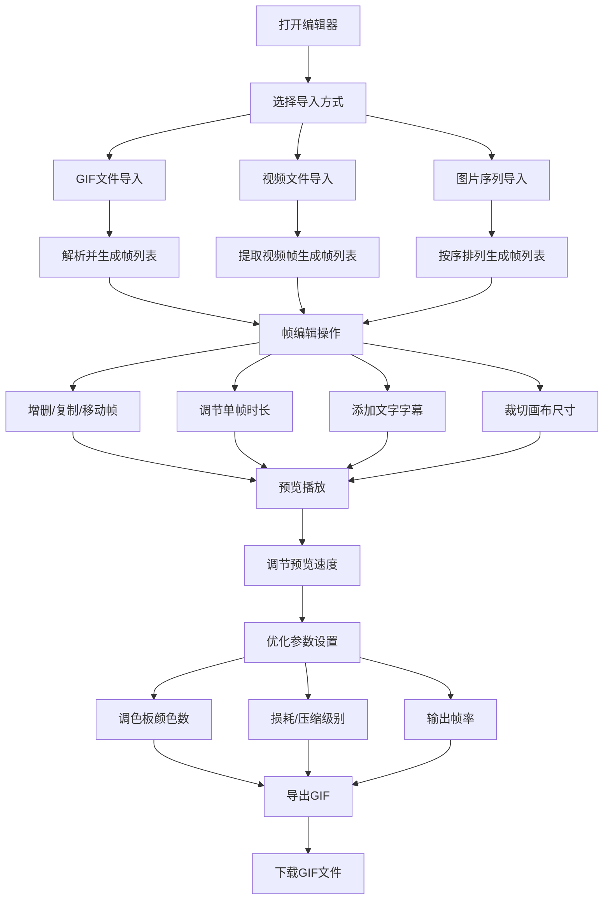

## 1. 产品概述
一款专业的Web端GIF动画编辑器，支持从视频、图片序列或现有GIF导入素材，进行逐帧编辑、特效处理和优化导出。
- 主要面向内容创作者、设计师和社交媒体运营人员，解决GIF制作流程繁琐、文件体积过大的痛点
- 目标是提供一站式的GIF创作体验，让用户无需专业软件即可完成高质量GIF的制作与优化

## 2. 核心功能

### 2.1 用户角色
| 角色 | 注册方式 | 核心权限 |
|------|----------|----------|
| 普通用户 | 无需注册，直接使用 | 全部编辑功能，本地文件导入导出 |

### 2.2 功能模块
1. **编辑器主界面**：素材导入区、帧时间轴、预览画布、属性面板、工具栏
2. **帧管理模块**：帧的增删、复制、移动、排序、时长调节
3. **素材导入模块**：GIF导入解析、视频帧提取、图片序列导入
4. **视觉编辑模块**：文字字幕、尺寸裁切、颜色调整
5. **优化导出模块**：调色板优化、帧率调整、有损压缩、GIF导出

### 2.3 页面详情
| 页面名称 | 模块名称 | 功能描述 |
|----------|----------|----------|
| 编辑器主界面 | 顶部工具栏 | 新建项目、导入素材、导出GIF、撤销重做、播放控制 |
| 编辑器主界面 | 左侧帧面板 | 帧缩略图列表、拖拽排序、增删复制操作、单帧时长设置 |
| 编辑器主界面 | 中央预览区 | 画布预览、播放/暂停、速度调节、缩放控制 |
| 编辑器主界面 | 右侧属性面板 | 全局设置、字幕管理、裁切参数、颜色/调色板优化选项 |
| 导入对话框 | 素材导入 | 支持GIF文件、视频文件(mp4/webm等)、多张图片批量导入 |
| 导出对话框 | GIF导出 | 预览文件大小、调色板颜色数、损耗级别、帧率设置、下载按钮 |

## 3. 核心流程
用户打开编辑器 → 导入素材（GIF/视频/图片序列）→ 逐帧编辑（增删/排序/时长）→ 添加视觉效果（字幕/裁切）→ 优化参数调节（调色板/帧率）→ 预览效果 → 导出优化后的GIF文件

## 4. 用户界面设计

### 4.1 设计风格
- **主色调**：深紫色 (#7C3AED) 作为主强调色，搭配深灰蓝 (#1E293B) 背景，营造专业的创意工具氛围
- **辅助色**：亮青色 #06B6D4 用于交互反馈，珊瑚橙 #F97316 用于警示/重要操作
- **按钮风格**：圆角8px，微渐变填充，hover时有发光效果，按下时有细微下沉动画
- **字体**：标题使用 Space Grotesk，正文使用 Geist Mono，等宽字体增强工具属性
- **布局风格**：三栏式专业编辑器布局（左帧面板 + 中央预览 + 右属性面板），可拖拽调整面板宽度
- **图标风格**：使用 Lucide 图标库，线性风格，统一20px尺寸

### 4.2 页面设计概述
| 页面名称 | 模块名称 | UI元素 |
|----------|----------|--------|
| 编辑器主界面 | 顶部工具栏 | 深色背景条、品牌Logo、工具按钮组、状态指示器 |
| 编辑器主界面 | 帧时间轴 | 水平滚动缩略图列表、拖拽手柄、选中帧高亮、帧序号标签、时长角标 |
| 编辑器主界面 | 中央画布 | 棋盘格透明背景、播放控制悬浮条、缩放百分比显示 |
| 编辑器主界面 | 右侧属性面板 | 分组折叠面板、滑块控件、色板选择器、数字输入框 |
| 导入/导出对话框 | 模态窗口 | 半透明毛玻璃背景、拖拽上传区、进度条、文件大小预估 |

### 4.3 响应式
桌面端优先设计，最低支持1280px宽度。在窄屏下（<1024px），左右面板可折叠为图标式抽屉，保证画布预览区域始终可用。触控设备下优化拖拽热区和按钮尺寸。
