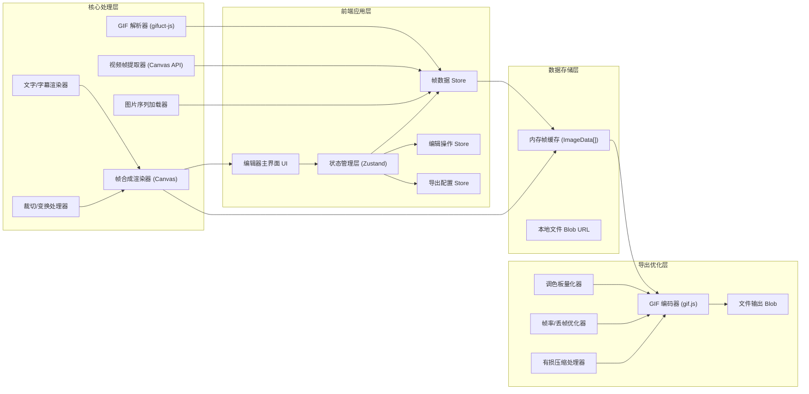

## 1. 架构设计



## 2. 技术描述
- **前端框架**: React 18 + TypeScript
- **构建工具**: Vite 5
- **样式方案**: Tailwind CSS 3
- **状态管理**: Zustand (轻量级，适合编辑器场景)
- **图标库**: Lucide React
- **GIF 解析**: gifuct-js (纯JS解析，浏览器端可用)
- **GIF 编码**: gif.js (Web Worker 编码，不阻塞UI)
- **画布操作**: 原生 Canvas 2D API (用于帧合成、裁切、文字渲染)
- **拖拽排序**: @dnd-kit/core + @dnd-kit/sortable (现代化拖拽方案)
- **后端**: 无，纯浏览器端应用，所有处理在本地完成

## 3. 路由定义
| 路由 | 用途 |
|------|------|
| / | 编辑器主界面（单页应用，无多路由） |

## 4. 核心数据结构

### 4.1 帧数据模型
```typescript
interface Frame {
  id: string;
  imageData: ImageData;
  delay: number;
  width: number;
  height: number;
  disposalMethod: number;
}
```

### 4.2 字幕数据模型
```typescript
interface Caption {
  id: string;
  text: string;
  frameRange: [number, number];
  x: number;
  y: number;
  fontSize: number;
  fontFamily: string;
  color: string;
  strokeColor: string;
  strokeWidth: number;
  align: 'left' | 'center' | 'right';
}
```

### 4.3 裁切配置
```typescript
interface CropConfig {
  enabled: boolean;
  x: number;
  y: number;
  width: number;
  height: number;
}
```

### 4.4 导出配置
```typescript
interface ExportConfig {
  colors: number;
  quality: number;
  fps: number;
  dither: boolean;
  repeat: number;
  width: number;
  height: number;
}
```

## 5. 核心模块设计

### 5.1 模块划分
```
src/
├── components/
│   ├── Toolbar/              # 顶部工具栏
│   ├── FramePanel/           # 左侧帧面板（缩略图列表、拖拽排序）
│   ├── PreviewCanvas/        # 中央预览画布
│   ├── PropertyPanel/        # 右侧属性面板
│   ├── ImportDialog/         # 导入对话框
│   └── ExportDialog/         # 导出对话框
├── stores/
│   ├── frameStore.ts         # 帧数据状态管理
│   ├── editorStore.ts        # 编辑操作状态
│   └── exportStore.ts        # 导出配置状态
├── hooks/
│   ├── useGifParser.ts       # GIF解析Hook
│   ├── useVideoExtractor.ts  # 视频帧提取Hook
│   ├── useFrameRenderer.ts   # 帧渲染Hook
│   └── useGifExporter.ts     # GIF导出Hook
├── utils/
│   ├── gifDecoder.ts         # GIF解码工具
│   ├── gifEncoder.ts         # GIF编码工具
│   ├── colorQuantizer.ts     # 调色板量化
│   ├── frameProcessor.ts     # 帧处理（裁切、合成字幕）
│   └── imageUtils.ts         # 图片处理工具函数
├── types/
│   └── index.ts              # 全局TypeScript类型定义
├── App.tsx
├── main.tsx
└── index.css
```

### 5.2 关键实现思路
1. **GIF解析**: 使用 gifuct-js 解析 GIF，将每一帧的 LZW 压缩数据解码为 ImageData，处理 disposal method 实现帧合成
2. **视频帧提取**: 创建隐藏的 `<video>` 元素，通过 `requestVideoFrameCallback` 或定时 `seek` + `drawImage` 提取指定时间点的帧
3. **帧合成渲染**: 每帧渲染时先绘制原始帧，再叠加裁切、字幕等效果层，使用离屏 Canvas 提升性能
4. **调色板优化**: 使用中值切割算法 (Median Cut) 进行颜色量化，支持抖动 (Floyd-Steinberg) 提升视觉质量
5. **导出优化**: 根据帧率设置自动跳帧，通过 quality 参数控制有损压缩强度，Web Worker 中编码避免UI阻塞
